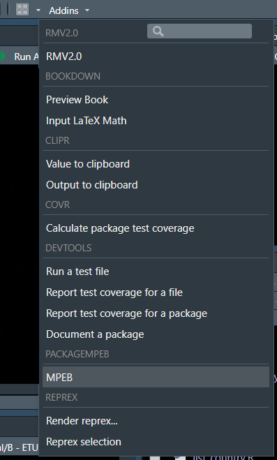

Package MPEB
============

This package is developed by Biomasse Normandie. It was tested for R
version 4.0.4.

Installation
------------

To use packagempeb you have to install  
	
- R (version 3.4.2 or later), which is an open source programming language and software environment for statistical computing : https://cran.r-project.org/
- A web browser such as Chrome, Firefox or Safari
- RStudio, which is an open source integrated development environment (IDE) for R : https://www.rstudio.com/
- devtools R package, which is providing R functions that simplify R package installation from github

Once R and RStudio are installed, open RStudio
Install devtools package with the following lines :

``` r
install.packages("devtools")
```

Then you can install our package from the github with the command :

``` r
devtools::install_github("BiomasseNormandie/MetV/packagempeb")
```

Starting the UI
---------------

Once the package is installed, to start the User Interface you’ll have
to click on Addins –\> MPEB 

The first run will take few minutes to install the other required
packages.
